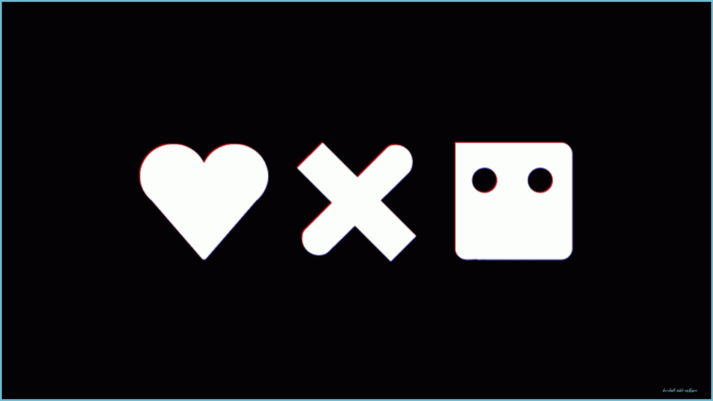

[](https://www.linkedin.com/in/jahidul-islam-rahat/)
[](https://www.facebook.com/jahidulislam.rahat97/)
[](https://www.instagram.com/hutum_pecha_rahat/)
[](https://hutumpecharahat.blogspot.com/)


```
Hey there 👋
     I’m Jahidul Islam Rahat, 22 years old. I'm a self-taught Embedded Software Developer. 
     I have been working on different platforms such as Robotic, IoT, Automation since 2016.
     Recently I grew some interest in the Machine Learning platform. 
     I am currently pursuing my 2nd year Bachelor of Engineering in CSE from Bangladesh. 
     I'm interested in doing research on Robotics, IoT, Vision related problems. 
     I love to work with new technologies and playing with AI.
```


## 🎉 Achievements

```
 
        ┌──😜... wait and see.
  ┌── 2021
  │
  │     ┌── 🏆Achievement Unlocked🏆 1st Publication : 2020 IEEE Region 10 Symposium(TENSYMP).
  │     ├── Banglalink SDG Hackathon ”Code for a Cause 2.0” – 1st Runner’s up.
  │     ├── Banglalink IT Incubator - Top 5.
  ├── 2020
  │
  │     ┌── In Search of Inventor 2019 - Top 7.     
  │     ├── NASA Space Apps Challenge 2019 - Champion(BD) &  Global Nominee.
  │     ├── NASA Space Apps Challenge 2019 - Runner’s up(BD) & Global Nominee.
  │     ├── Skill Competition 2019 - Champion.
  ├── 2019
  │
  │     ┌── 2 more...
  │     ├── NASA Space Apps Challenge 2018 - Champion(BD).
  │     ├── Cumilla University Science Festival 2018- Champion.
  │     ├── 13th Bangladesh Astro-Olympiad 2018 - Regional Winner.
  │     ├── Skill Competition 2018 - Champion.
  ├── 2018
  │
  │     ┌── 3 more...
  │     ├── Skill Competition 2017 - Runner’s up.
  ├── 2017 
  │
Journey Begins here....*

```


## 📌 Pinned Repositories

<br>

<a href="https://github.com/jahidulislamrahat97/iotsnacksbox_server">
  
</a>


<br>
<br>

## &#x1f4c8; GitHub Stats

<br>

<a href="https://github.com/jahidulislamrahat97">
  
</a>

<br>
<br>
<a href="https://github.com/jahidulislamrahat97">
  
</a>

<br>
<br>

## 💼 Skills


